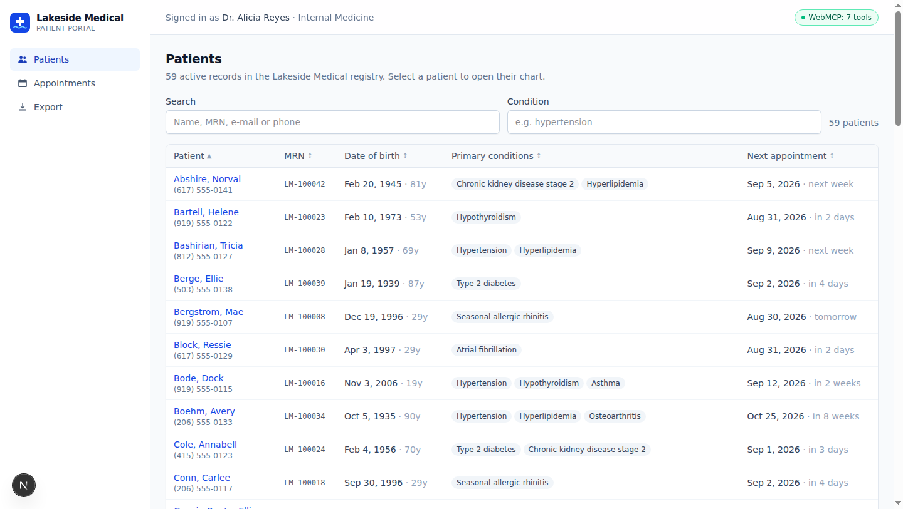
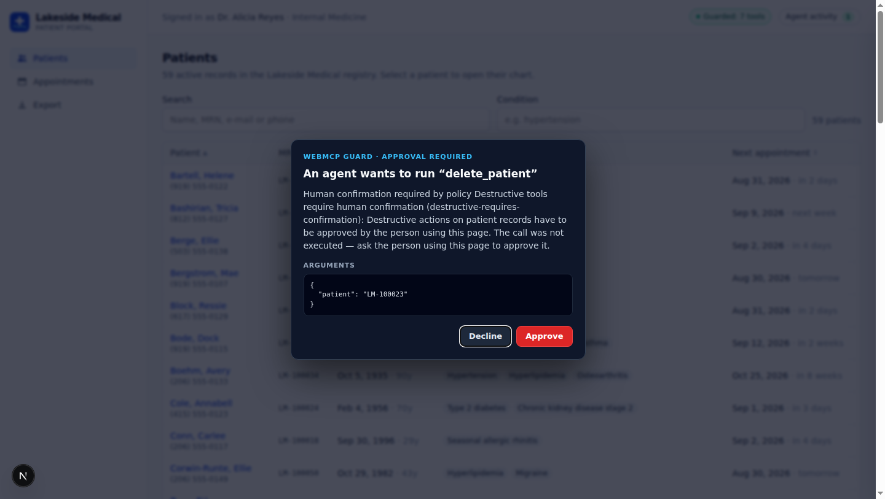
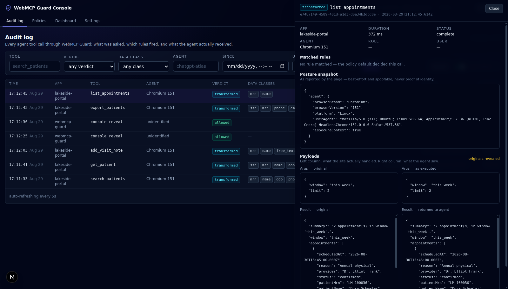

# WebMCP Guard

**A drop-in SDK that wraps a website's WebMCP tools with enterprise security controls — policy-based authorization, agent/browser posture checks, and sensitive-data tokenization — managed from a web console, so organizations can open their internal apps to AI agents without opening their data.**

WebMCP lets any website hand structured tools to an AI agent. For an app that holds real records, that is simultaneously what the business wants and what the security team blocks: an agent with tool access can read PII, export records and delete things, and everything it reads flows into a third-party model's context. Today, every company that wants agent access to a sensitive internal app has to hand-build authorization, redaction and audit around every single tool — so most will just block agents instead.

WebMCP Guard is that layer, built once. You register tools through the guard instead of directly with `document.modelContext`, and every call is resolved against policy, every result is classified and transformed, and every step lands in an audit log an administrator reads in a console. The demo in this repo is a fictitious hospital portal, but nothing in the SDK is healthcare-specific.

- **Repo layout:** [monorepo table](#monorepo)
- **Integrate it in 15 minutes:** [`packages/sdk/README.md`](packages/sdk/README.md)
- **Design pack (the spec this was built from):** [`docs/`](docs/)
- **Threat model, honestly:** [below](#threat-model-the-honest-version)

---

## The 60-second tour

Lakeside Medical is a Next.js patient portal with 60 synthetic patients and seven WebMCP tools — search, read, update, note, appointments, export, delete. Humans use it normally. Agents get the same seven tools.



### Before: what an agent sees with raw WebMCP

Phase 1 of this build registered those tools directly with `document.modelContext.registerTool` and called them from a real WebMCP browser. This is a verbatim excerpt of what came back — captured in [`docs/captures/phase1-before/`](docs/captures/phase1-before/):

```
LM-100028,Tricia,Bashirian,1957-01-08,927-78-1337,(812) 555-0127,
tricia.bashirian27@example.com,"343 Forest Avenue, North Ednamouth, SC 94944",
BlueRidge Assurance,JVQ768472895,Hypertension; Hyperlipidemia,...
```

Name, date of birth, SSN, phone, e-mail, street address and insurance member id, straight into the model's context — and `delete_patient` removed a record with no prompt of any kind ([`tool-delete_patient-silent.txt`](docs/captures/phase1-before/tool-delete_patient-silent.txt)). That is the default posture of an agent-enabled app, and it is why the security team says no.

### After: the same tool, through the guard

The same record, returned by `get_patient` through WebMCP Guard's default seeded policy. This is the guard's real response body, captured from a clean clone and abridged only where marked:

```
{
  "mrn": "tok_mrn_e53e5143",
  "name": "tok_name_23240732",
  "dob": "age 60-69",
  "ssn": "tok_ssn_d50b2b54",
  "phone": "(812) 555-0127",
  "email": "t•••@example.com",
  "addressStreet": "North Ednamouth, SC",
  "insuranceMemberId": "tok_insurance_id_c8cec5b9",
  "primaryConditions": ["Hypertension", "Hyperlipidemia"],
  "allergies": ["Peanuts", "Sulfa drugs"],
  "notes": [
    {
      "author": "Dr. Alicia Reyes",
      "body": "August 19, 2026 — tok_name_23240732 (DOB age 60-69, MRN
               tok_mrn_e53e5143) seen today for medication reconciliation.
               Blood pressure 138/98."
    }
  ],
  ...
}
```

Transformed results also end with a short **privacy notice written for the
model** — which values were replaced, by which rule, that tokens are stable
identity handles it can pass back into any tool, and that masked and
generalized values cannot be recovered — so the agent reasons about tokens
correctly instead of guessing.

Three things are happening at once, and the third is the point:

1. **Identifiers are tokenized, not deleted.** `tok_ssn_…` is an HMAC of the value under an org secret, so the same SSN always produces the same token. The agent can still reason about identity and equality.
2. **Some classes are generalized instead.** `dob` becomes an age bracket, `address` collapses to city/state, `email` is masked. Clinically useful fields — conditions, medications, allergies, phone, appointment times — pass through in the clear. The guard is not redaction-happy.
3. **Free text is scanned too, and the spans agree with the fields.** The visit note is prose, but `tok_name_23240732` inside the note body is byte-identical to the `name` token on the record. The agent can read a note, notice it is about the same person as the search hit, and act — without either value ever existing in its context.

And the loop closes: hand `tok_mrn_e53e5143` back to `add_visit_note`, and the gate swaps the real MRN in server-side before the tool runs. **The agent does useful work on data it has never seen.**

### When policy says no, it says why

Destructive tools ask the person at the keyboard, in the page:



Bulk export demands a written justification, which is evaluated and then stored on the audit entry. These are the guard's real, un-edited replies to the agent:

> Justification required by policy Export requires justification (`export-requires-justification`): call "export_patients" again with a "justification" argument of at least 40 characters explaining why this data is needed and for whom — name the person or team who asked, and what they will do with it.

> Human confirmation required by policy Destructive tools require human confirmation (`destructive-requires-confirmation`): Destructive actions on patient records have to be approved by the person using this page. The call was not executed — ask the person using this page to approve it.

Every string an agent reads back is written for a model to act on — what happened, which policy did it, and what to do next. No stack traces, no status codes, no scolding. They all live in [`packages/server/src/messages.ts`](packages/server/src/messages.ts) and [`packages/sdk/src/messages.ts`](packages/sdk/src/messages.ts).

### And an administrator can see all of it



Every call — allowed, denied, transformed, human-approved — is one row with the matched rule ids, the agent's posture, the resolved identity, and both payloads before and after. Revealing a stored value in the console is itself written to the audit log.

---

## Architecture

The client SDK is the integration point. The server is the enforcement point. Nothing secret ever lives in the page.

```
Agent (ChatGPT in-app browser / Chrome 149+ with WebMCP)
  │  calls a WebMCP tool
  ▼
document.modelContext ──▶ guarded execute()          @webmcp-guard/sdk  [browser]
                            │
                            │ 1. POST /api/guard/gate
                            │    { tool, args, toolTags, posture, sessionContext }
                            ▼
                          @webmcp-guard/server   [Node, mounted in the host app]
                            2. resolve identity server-side (resolveSession)
                            3. match ordered policy rules → gate verdict + transform matrix
                            4. posture check (browser brand/version, secure context, agent id)
                            5. verdict: allow | deny | require-confirmation | require-justification
                            6. on allow only: detokenize tokens in args from the vault
                            │
             ┌──────────────┤  verdict + executable args
             ▼              │
   deny / ask a human       │  allow
   → agent-legible string   ▼
   → audit entry          7. the site's own execute(args) runs IN THE PAGE
                            │   (so the human watches the action happen in the UI)
                            │ result
                            ▼
                          8. POST /api/guard/transform  { callId, result }
                            9. classify (field names → regex → host name dictionary)
                           10. tokenize / mask / contextualize / passthrough per class
                           11. write the vault, close the audit entry
                            │
                            ▼
                          12. transformed result returned to the agent
```

Three invariants hold this together:

- **The vault is server-side, always.** The token → value map, policy, logs and the justification evaluator live in `@webmcp-guard/server`. The page never holds a detokenization map, and a call that was denied never gets one value out of the vault — so the gate cannot be used as a detokenization oracle.
- **It fails closed.** If `/gate` or `/transform` cannot be reached, or answers something outside the wire contract, the SDK drops the result and tells the agent it was withheld. An untransformed result never reaches a model.
- **The console owns no database.** It is a stateless client of the guard API that the host app mounts. Your app owns the data store; the console plugs into it.

### Monorepo

| Package                   | Name                           | What it is                                                                                                                                    |
| ------------------------- | ------------------------------ | --------------------------------------------------------------------------------------------------------------------------------------------- |
| `packages/shared`         | `@webmcp-guard/shared`         | Zod schemas for the policy model, wire contracts and log records — one source of truth for the SDK, server and both apps.                     |
| `packages/sdk`            | `@webmcp-guard/sdk`            | Browser half. Wraps `registerTool`, rewrites schemas from policy, runs the pipeline, renders the confirmation modal, emits page-local events. |
| `packages/server`         | `@webmcp-guard/server`         | Node half and the enforcement point: policy engine, classifier, deterministic tokenizer, encrypted vault, audit writer, HTTP routes.          |
| `packages/storage-sqlite` | `@webmcp-guard/storage-sqlite` | Durable `GuardStorage` on better-sqlite3. Can adopt the host app's existing connection so guard tables live in the app's own database file.   |
| `packages/storage-memory` | `@webmcp-guard/storage-memory` | In-memory `GuardStorage`. The test store, and the worked example of "bring your own database" in one readable file.                           |
| `apps/portal`             | Lakeside Medical               | The demo app: patient portal, seven WebMCP tools, the guard server mounted at `/api/guard`, SQLite. Port 3000.                                |
| `apps/console`            | WebMCP Guard Console           | Audit log, policy editor with a per-class transform matrix, dashboard. Port 3001.                                                             |

**1,139 tests across 54 files**, run in one pass with `pnpm test`.

---

## The literal WebMCP call

The challenge requires a plainly visible `document.modelContext.registerTool(...)` in the repository. WebMCP Guard is a wrapper, so the whole product touches WebMCP in exactly one file — [`packages/sdk/src/webmcp.ts`](packages/sdk/src/webmcp.ts), verbatim:

```ts
/** `document.modelContext.registerTool(...)` — the primary surface. */
export async function registerWithDocument(
  document: WebMcpHost,
  tool: WebMcpToolDefinition,
  options: WebMcpRegisterToolOptions,
): Promise<void> {
  await document.modelContext.registerTool(tool, options);
}

/** `navigator.modelContext.registerTool(...)` — the legacy explainer surface. */
export async function registerWithNavigator(
  navigator: WebMcpHost,
  tool: WebMcpToolDefinition,
  options: WebMcpRegisterToolOptions,
): Promise<void> {
  await navigator.modelContext.registerTool(tool, options);
}
```

Nothing is dynamically constructed and no property name is computed. `document` and `navigator` arrive as parameters only so this package can avoid declaring a global `Document.modelContext` augmentation that would collide with the host app's own WebMCP typings; the values passed in are always the real globals, resolved a few lines above. **This satisfies the challenge's `registerTool` requirement**, and the portal's tools reach the browser through it — see [`packages/sdk/src/index.ts`](packages/sdk/src/index.ts) for the caller.

The rest of the SDK programs against the wider API surface rather than just calling it once: it **rewrites `inputSchema`** to inject a required, described `justification` property when policy demands one (so the agent learns the requirement from the tool list instead of from a refusal); it **carries `annotations`** (`readOnlyHint`, `untrustedContentHint`) through to the browser per tool; it **owns an `AbortController` per registration** so policy can unregister a tool; and because re-registration in WebMCP is _abort-then-register_, a policy change aborts the live registration **before** building the replacement — an ordering the browser forced on us (see [what we learned](#what-we-learned-about-webmcp)).

---

## Quickstart

Verified from a clean `git clone` on Linux with Node 22 and pnpm 10.15.0. Requires **Node ≥ 20**.

```bash
git clone <this repo> webmcp-guard
cd webmcp-guard
pnpm install

# Recommended: gives the portal a console origin so CORS works locally.
cp .env.example apps/portal/.env.local

pnpm dev          # portal → http://localhost:3000, console → http://localhost:3001
```

Then:

1. **Portal** — <http://localhost:3000/patients>. The database is created and seeded on first boot: 60 synthetic patients, notes, appointments, and the default policy rules. No migration step, no fixtures to load.
2. **Console** — <http://localhost:3001>. It asks for an admin token. With the `.env.example` copy above, that token is `dev-admin-token-change-me`. (With **no** `.env.local` at all, the portal falls back to a committed default of `dev-only-admin-token--do-not-deploy` — see below.)
3. **Turn on WebMCP** — Chrome 149+ with `chrome://flags/#enable-webmcp-testing` enabled and a full relaunch, or open the portal in **ChatGPT's in-app browser**. The header chip turns green and reports the tool count; without WebMCP the portal still works normally for humans and the chip says so.
4. **Ask the agent** for something real: _"Find patients with hypertension who have an appointment this week."_ Then open the **Agent Activity** drawer in the portal header and watch the pipeline events, and the console's **Logs** page for the audit trail.

| Command          | What it does                                                  |
| ---------------- | ------------------------------------------------------------- |
| `pnpm dev`       | Portal (:3000) and console (:3001) in parallel                |
| `pnpm test`      | Vitest across every package and app in one pass (1,139 tests) |
| `pnpm typecheck` | `tsc --noEmit` per workspace package                          |
| `pnpm lint`      | ESLint flat config across the workspace                       |
| `pnpm format`    | Prettier write                                                |

### Insecure development defaults — read this before deploying

If `GUARD_ORG_SECRET`, `GUARD_VAULT_KEY` or `GUARD_ADMIN_TOKEN` are missing from the environment, the portal **does not fail to start**. It substitutes committed, deliberately worthless values (`dev-only-org-secret--do-not-deploy` and friends), prints a warning on the server console, and carries on:

```
[WebMCP Guard] Using insecure development defaults for: GUARD_ORG_SECRET,
GUARD_VAULT_KEY, GUARD_ADMIN_TOKEN. Anyone who can reach this deployment can
read its audit log and edit its policy. Copy .env.example to
apps/portal/.env.local and set real values before deploying.
```

This is a deliberate trade: a judge or a developer running `git clone && pnpm install && pnpm dev` gets a working, guarded portal with zero setup. It is safe to publish these values because they _are_ published — they protect nothing, and they are named so that finding one in a production environment reads as the incident it is. **Anything deployed must set real values.** See [`.env.example`](.env.example) for every variable and [`DEPLOYMENT.md`](DEPLOYMENT.md) for the Render + Vercel deploy, where the blueprint generates the secrets for you.

Two more notes on running it locally:

- **`GUARD_CONSOLE_ORIGIN` is required for the console.** The console is a different origin from the portal, and the guard API echoes exactly one configured origin in `Access-Control-Allow-Origin` — never `*`. Without it, the portal serves no CORS headers and the console cannot reach the API. `.env.example` sets it to `http://localhost:3001`, which is why the `cp` above is the recommended path.
- **Wipe `apps/portal/data/` to re-seed.** Seeding only runs against an empty store, by design: an administrator who deletes a default rule keeps it deleted.

---

## Threat model, the honest version

Condensed from [`docs/03-architecture.md`](docs/03-architecture.md). This section is deliberately not written as marketing.

**In scope — what WebMCP Guard actually protects against:**

- Sensitive data leaking into an agent's context, and from there into a third-party LLM, via tool results.
- Agents invoking destructive or out-of-policy tools without authorization, a written justification, or human confirmation.
- Having no audit trail of agent activity.
- Agents operating from environments the organization has not accepted (unidentified agent, browser older than the WebMCP era, insecure context).

**Out of scope — never claimed:**

- **A malicious human user.** The page's own JavaScript holds the raw data; anyone with DevTools can read it. WebMCP Guard governs the _agent channel_, not the DOM.
- **A malicious host page.** The guard is the site's own dependency, not a sandbox around the site.
- **Strong agent identity.** UA Client Hints are spoofable. Agent identification is an advisory signal, it is labelled as advisory in the console, and policy decisions that depend on it are opt-in and ship disabled.

### "Can the agent just go around the tools?"

The framing that matters: the human at the keyboard already has full access to this data. The question is not "can data escape" but "can a _browser agent_ obtain raw data or take actions without going through the guarded tools?"

- **Direct API calls, or tampered client code — no.** Enforcement is server-side. The gate, the vault, detokenization and the audit writer are all in `@webmcp-guard/server`. An agent that bypasses the SDK and calls the guard API directly gets exactly the same verdicts, the same tokenized data and the same log entries. There is no client-side decision to subvert.
- **DOM scraping and UI actuation — partially.** An agent that drives the human interface sees what the human sees. Two mitigations are real: the tools set `annotations.untrustedContentHint` and are described so that the tool path is the _efficient_ path, which is enough for a well-behaved agent; and the patient chart is **masked at rest** ([`docs/05`](docs/05-demo-app-requirements.md)) — SSN, date of birth, phone and e-mail are rendered as `•••-••-••••`-style masks by the server and never sent to the browser at all, so a scraped chart contains no identifier to scrape, and the one route that returns a real value (`POST /api/portal/reveal-field`) writes a `ui_reveal_field` entry naming the persona, the patient and the data class into the same audit log as every tool call _before_ it answers (free-text visit notes are still rendered as written: the mask covers structured identifiers, not prose a clinician has to read).
- **The residual gap, stated plainly:** a fully actuating agent driving a revealed UI is indistinguishable from the human, and no client-side library can close that. Closing it requires cooperation from the browser or agent runtime — an enterprise policy that restricts a given agent to the tool channel, or an attestation the page can verify. That is a platform-level problem, and it is exactly the deployment model this SDK is designed to slot into: when the browser can enforce "agents use tools", WebMCP Guard is what decides _which_ tools, with _what_ data, and writes down what happened.

Two smaller pieces of candor, because they are true:

- **`/gate` and `/transform` carry no guard-layer authentication**, on purpose. They are mounted inside the host app and reachable by exactly whoever can already reach the page; the host app's own session is the boundary, the same one that protects its data APIs. Nothing in this repo describes them as authenticated.
- **`export_patients` returns CSV text and is only partially protected by transformation.** The justification gate is the real control on that tool; structured export rows are future work. Known gaps are documented rather than hidden — see the work log in [`docs/07-development-plan.md`](docs/07-development-plan.md).

---

## What we learned about WebMCP

Building against a browser API this new means the spec and the implementation sometimes disagree. Three findings from this build, all caught by running real tool calls through a real WebMCP browser (headless Chromium 151, `scripts/webmcp-e2e.mjs` driving it over CDP), all recorded in the work log:

**1. `execute` is invoked with no second argument.** The typings (`webmcp-types`) declare `execute(input, { signal })`, and every one of the portal's seven tools destructured that options object. Chromium 151 calls `execute(input)` — one argument. Every tool crashed on the first agent call. The fix is `ctx?.signal`, and it is now baked into the SDK's public type: `execute(input, context?)` with the context optional and declared with method syntax so a host tool typed against `webmcp-types` still assigns cleanly.

**2. Registering a live tool name again keeps the _old_ tool.** Not the new one. This matters enormously for a policy-driven wrapper: when policy changes and a tool's input schema has to change with it, the intuitive "build the new registration, then drop the old one" leaves the page serving the stale schema _forever_. Re-registration in practice is **abort, then register** — you must unregister first and accept a sub-millisecond window where the tool is absent. The SDK therefore owns an `AbortController` per registration rather than passing the host's signal straight through, and it restores the previous definition if the replacement fails to register.

**3. The flag is not the only surface, and the documented one is not always the working one.** Feature detection has to try `document.modelContext` _and_ the older `navigator.modelContext` from the explainer era — both are live in the wild. And the documented entry point (`chrome://flags/#enable-webmcp-testing`) was not how our local Chromium exposed it at all: the snap build needed `--enable-features=WebMCP` on the command line before `document.modelContext` appeared. Anything shipping against WebMCP today should feature-detect both surfaces, degrade silently when neither is present, and never assume a single documented flag is the whole story.

---

## Deployed URLs

| What                    | URL                                                                                            | Credentials                                          |
| ----------------------- | ---------------------------------------------------------------------------------------------- | ---------------------------------------------------- |
| Lakeside Medical portal | [webmcp-guard-portal.onrender.com/patients](https://webmcp-guard-portal.onrender.com/patients) | No login; switch persona in the header               |
| WebMCP Guard Console    | [webmcp-guard-console.vercel.app](https://webmcp-guard-console.vercel.app)                     | Admin token: provided on the Devpost submission form |
| Demo video              | `TODO-until-video`                                                                             | —                                                    |

Deploy procedure: [`DEPLOYMENT.md`](DEPLOYMENT.md) + [`render.yaml`](render.yaml).

The portal runs on a free Render instance, which sleeps when idle: the first request after a period of inactivity can take roughly a minute to wake. The disk is ephemeral across restarts, and that is fine — schema, demo patients and the default policy are all seeded on boot.

---

## Demo data

**Every record in this repository is synthetic.** "Lakeside Medical" is not a real organization. Patients, MRNs, SSNs, addresses, insurance ids, clinicians and visit notes are generated by a deterministic faker seed (`apps/portal/lib/db/seed.ts`) and contain no real personal information. Phone numbers use the `555-01xx` block reserved for fiction and e-mail addresses use the reserved `example.com` domain. Every page of the portal carries the notice _"Demo environment — all patient records are synthetic."_

## Documentation

The [`docs/`](docs/) directory is the design pack this project was built from, kept as written: the project brief, the challenge requirements, the architecture and threat model, the SDK requirements, the demo app and console specs, a WebMCP API reference, and [`docs/07-development-plan.md`](docs/07-development-plan.md) — whose work log records every deviation, decision and known gap, dated, including the three browser findings above.

For integrating the SDK into your own app, start at [`packages/sdk/README.md`](packages/sdk/README.md).

## License

MIT — see [`LICENSE`](LICENSE).
